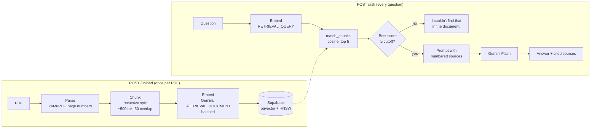

# Doc Q&A Bot

Upload a PDF and ask questions about it. Each answer cites the **exact paragraphs and page numbers** it came from, so you can check it yourself.

A retrieval-augmented generation (RAG) pipeline built from scratch: **FastAPI** · **Supabase pgvector** · **Gemini** (embeddings + generation) · **Next.js** chat UI.

```
Q: How many vacation days do I get each year?
A: Full-time employees receive 24 days of paid annual leave per calendar year, plus local public holidays [1].

[1] page 2 · score 0.71 · "Leave policy. Full-time employees receive 24 days of paid annual leave…"
```

---

## Why it's built this way

| Decision | Reason |
|---|---|
| **Sources returned with every answer** | Users can verify claims instead of trusting the model. Each `[n]` in the answer maps to a source card with page and similarity score. |
| **Two-layer refusal** | A cheap **score gate** blocks clearly off-topic questions without calling the LLM; a **prompt rule** makes the model refuse when the gate lets something through. The eval shows why both are needed (below). |
| **Cutoff chosen from data** | `SCORE_CUTOFF` comes from a sweep over a labelled question set, not a guess. |
| **Per-page chunking** | Every chunk belongs to exactly one page, so citations are always accurate. |
| **768-dim embeddings** | pgvector's HNSW index supports up to 2,000 dims; 768 keeps search fast with negligible quality loss. |
| **Embed before writing** | If Gemini fails mid-upload the database is untouched; if the DB fails mid-insert, partial rows are cleaned up. |
| **Retries + fallback model** | Exponential backoff on 429/5xx; if the main model stays overloaded, the same prompt goes to a lighter model. |
| **Interfaces + fakes** | Routes depend on `Embedder` / `VectorStore` / `Generator` protocols, so 84 backend tests run offline in about a second. |
| **Built for a public URL** | Per-IP rate limits protect the Gemini quota; an hourly database job deletes anything a closed tab left behind. |

---

## Architecture



---

## Evaluation

`scripts/run_eval.py` ingests a fictional 6-page employee handbook (fictional so the model can't answer from its own knowledge), asks **16 answerable** questions (deliberately reworded, e.g. "vacation days" vs "paid annual leave") and **6 off-topic** ones, then sweeps the score cutoff.

| Metric | Result |
|---|---|
| Hit rate @1 (right page ranked first) | **100%** |
| Hit rate @5 | **100%** |
| MRR | **1.000** |
| End-to-end answers correct | **22 / 22** |
| Real questions answered at cutoff 0.56 | **100%** |
| Off-topic blocked by the gate alone | **83%** (the rest refused by the model) |

**Finding:** one off-topic question scored *higher* (0.668) than the weakest real question (0.610). Questions about the document's subject that the document can't answer, like "What is the stock price?", look relevant to vector search. No single cutoff separates them, which is why the prompt-level refusal rule exists. Full report: [`backend/evals/results.md`](backend/evals/results.md).

---

## API

Interactive docs at `http://localhost:8000/docs` when the server is running.

### `POST /upload`

`multipart/form-data` with a `file` field.

```json
{ "doc_id": "3f1c…", "filename": "handbook.pdf", "pages": 6, "chunks": 6 }
```

| Status | When |
|---|---|
| 413 | File larger than `MAX_UPLOAD_MB` |
| 415 | Not a PDF (checked by name *and* `%PDF-` magic bytes) |
| 422 | Encrypted, scanned (no text), or more than `MAX_PAGES` pages |
| 502 / 503 | Gemini / database unavailable |

### `POST /ask`

```json
{ "doc_id": "3f1c…", "question": "Who leads the delivery robot project?" }
```

```json
{
  "answer": "The project is led by Dr. Wanjiru Kamau [1].",
  "grounded": true,
  "sources": [
    { "n": 1, "page": 5, "chunk_index": 4, "score": 0.72, "content": "Project BLUEHERON…", "cited": true }
  ]
}
```

`grounded: false` means the score gate refused without calling the LLM; `sources` still holds the closest matches. `cited` marks which sources the answer referenced. Errors: 404 unknown document, 422 invalid input, 502 / 503 upstream failure.

### `DELETE /documents/{doc_id}`

Removes a document's chunks. Returns `{ "doc_id": "…", "deleted_chunks": 6 }` or 404.

---

## Running locally

**Prerequisites:** Python 3.12, [uv](https://docs.astral.sh/uv/), a free [Supabase](https://supabase.com) project and a [Gemini API key](https://aistudio.google.com).

```bash
cd backend
uv venv -p 3.12 && source .venv/bin/activate
uv pip install -r requirements.txt
cp .env.example .env          # then fill in the three keys
```

**Database:** in Supabase → SQL Editor, run [`backend/sql/001_init.sql`](backend/sql/001_init.sql). It creates the `chunks` table, HNSW index and `match_chunks()` search function, with row-level security on.

```bash
uvicorn app.main:app --reload    # http://localhost:8000/docs
```

Frontend, in a second terminal:

```bash
cd frontend
cp .env.example .env.local    # NEXT_PUBLIC_API_URL=http://localhost:8000
npm install
npm run dev                   # http://localhost:3000
```

---

## Deployment

| Part | Host | Notes |
|---|---|---|
| Frontend | **Vercel** (Hobby) | Root directory `frontend`, env `NEXT_PUBLIC_API_URL` |
| Backend | **Render** (Docker, from `render.yaml`) | Free plan sleeps after 15 min idle (~1 min cold start; the UI shows "waking up"). Starter plan stays on. |
| Database | **Supabase** | Run `sql/001_init.sql`, then `sql/002_cleanup.sql` (hourly cleanup via `pg_cron`) |
| CI | **GitHub Actions** | `ci.yml` runs both test suites and a production build on every push; `keepalive.yml` pings `/ready` every 3 days so Supabase's free tier doesn't pause |

Health endpoints: `GET /health` (process up) and `GET /ready` (database reachable).

---

## Testing

```bash
python -m pytest -q                  # 84 offline tests, no network, ~1s
python -m pytest -q -m live -s       # 8 tests against real Gemini + Supabase
python scripts/run_eval.py           # retrieval eval → evals/results.md
python scripts/run_eval.py --answers # + end-to-end answer checks (uses LLM quota)
python scripts/inspect_pdf.py file.pdf  # see how a PDF is parsed and chunked

cd ../frontend && npm test           # 26 tests: citation parser, API client, chat state, file checks
```

| Layer | Covers |
|---|---|
| **Unit** | chunker (no text lost, overlap, size limits, page tagging), parser (blank, scanned, encrypted, page limit), embedder (batching, task types, normalization, backoff), generator (fallback, empty answers), prompt builder, score gate, citation parsing, eval metrics |
| **Route** (fakes) | upload validation and every error code, cleanup after a failed insert, `/ask` gating and sources, CORS |
| **Live** | pgvector ordering and per-document scoping, real embedding similarity, full upload → ask round trip, off-topic refusal |

---

## Configuration

All settings live in `backend/.env`. Only the first three are required.

| Variable | Default | Notes |
|---|---|---|
| `GEMINI_API_KEY` | | required |
| `SUPABASE_URL` | | required |
| `SUPABASE_SERVICE_KEY` | | required (secret key; stays on the server) |
| `ALLOWED_ORIGINS` | `http://localhost:3000` | comma-separated CORS origins |
| `EMBED_MODEL` / `EMBED_DIM` | `gemini-embedding-001` / `768` | dim must match `vector(768)` in the SQL |
| `GEN_MODEL` | `gemini-flash-latest` | answer model |
| `GEN_FALLBACK_MODEL` | `gemini-flash-lite-latest` | used when the main model is overloaded; empty disables |
| `CHUNK_TOKENS` / `CHUNK_OVERLAP_TOKENS` | `500` / `50` | |
| `TOP_K` | `5` | chunks sent to the LLM |
| `SCORE_CUTOFF` | `0.56` | from the eval sweep; re-run the eval if you change models |
| `MAX_PAGES` / `MAX_UPLOAD_MB` | `200` / `10` | upload limits |
| `UPLOAD_LIMIT_PER_HOUR` / `ASK_LIMIT_PER_HOUR` | `10` / `60` | per client IP; `0` disables |
| `ALLOWED_ORIGIN_REGEX` | | optional, e.g. Vercel preview URLs |

---

## Project structure

```
backend/
├── app/
│   ├── main.py         # FastAPI routes: /health, /upload, /ask, DELETE /documents
│   ├── config.py       # typed settings from .env
│   ├── parsing.py      # PDF → pages (PyMuPDF, paragraph cleanup)
│   ├── chunking.py     # recursive splitter with overlap, per-page chunks
│   ├── embeddings.py   # Gemini embedder: batching, normalization, backoff
│   ├── store.py        # VectorStore protocol + Supabase implementation
│   ├── ingest.py       # parse → chunk → embed → store, with cleanup
│   ├── generation.py   # Gemini generator: retries, fallback model
│   ├── rag.py          # prompt, score gate, citations, answer_question()
│   └── db.py           # Supabase client, pgvector formatting
├── sql/001_init.sql    # table, HNSW index, match_chunks(), RLS
├── evals/              # dataset, metrics, results.md
├── scripts/            # run_eval.py, inspect_pdf.py
└── tests/              # unit, route (fakes), live/
frontend/               # Next.js chat UI (upload, chat, citation chips, sources panel)
docs/                   # architecture diagram (Excalidraw)
```

---

## Limitations and roadmap

**Current scope (MVP):** single PDF per chat, text-based PDFs only (no OCR), no auth, documents can be deleted via the API.

- [x] Next.js chat UI with source cards and citation highlighting
- [ ] Stream answers token-by-token (SSE)
- [ ] Hybrid search: vector + Postgres full-text, merged with reciprocal rank fusion
- [ ] Reranker: retrieve top 20, rerank to top 5
- [ ] Query rewriting so follow-up questions work in a conversation
- [x] Deploy: Vercel (UI) · Render (API, Docker) · Supabase
